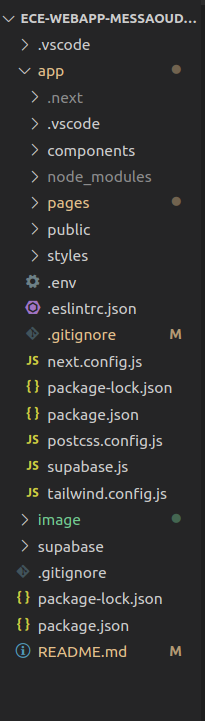

# Blogging application - ECE Webtech project

  Our application is primarily intended for the World Cup to comment on the achievements of each of the different national teams! Everyone can add their favorite team and share their feelings. It's also a way to get information on different points such as the name of the coach, the captain of the team or the choice of the device of each team.

## Production 

- Vercel URL: https://ece-webapp-messaoudi-zouitene.vercel.app/
- Supabase project URL: https://lsmbmkrtvagrqakizced.supabase.co

## Usage

*how to start and use the application, run the tests, ...*

* Clone this repository, from your local machine:
  ```
  git clone ...
  cd ...
  ```
* Start the the application
  ```bash
  cd app
  # Install dependencies (use yarn or npm)
  npm install
  npm run build
  npm run dev 
  ```
* If you want to check if everythong is correctly built run : 
```bash
  npm run build
```
## Authors

*name, email, ...*

## Tasks
  
**Project management:**

* Naming convention   
 
  Each Component or variable follows the react, html or css naming conventions. We can see for example the react functions begin with a lowercase.

> **Graduation** The graduation estimation for this section is : 2/2

* Project structure   

  

  Our Project is well organized with a an app folder divided in several subfolders: 

    * [Component Folder](/app/components): Contain all the necessary components of the app such as [Header](/app/components/header.js) , [Footer](/app/components/footer.js) or even [UserContext](/app/components/UserContext.js)

    * [Pages Folder](/app/pages/) : Contain all the different pages of our app such as [Login](/app/pages/Login.js) or [Equipe](/app/pages/equipe/)

    * [Supabase Folder](/supabase/) : Contain all the necessary information to connect to [Supabase](/supabase/) locally ( or online)

    * [Public Folder](/app/public/) : Contain all the different picture for our app 
    
    * [Style Folder](/app/styles/) : Contain all the different styles and css for each component 

  > **Graduation** The graduation estimation for this section is : 2/2

* Git   

  

  Throughout the project, we made regular commits, performed merges and managed conflicts after validation of each feature. We can then follow all our progress chronologically during these last months 

  > **Graduation** The graduation estimation for this section is : 2/2

* Code quality   

  

  In order to evolve efficiently, we have taken the time to focus on indentation, function/variable explicitness and spacing of our code.

  > **Graduation** The graduation estimation for this section is : 3/4

  
* Design, UX, and content   

  

  The proposed application has been designed to be as intuitive as possible and offer the user a pleasant experience. This starts with the choice of his favorite theme at any time (accessible through the header)

  Our styles are implemented with Taildwind and classic css like on the following screen :

  


  > **Graduation** The graduation estimation for this section is : 3.5/4


**Application development:**

* Home page   

  

  Our home page offers a search of the teams according to their continent. Thus, you can consult the information of all the teams present at the tournament coming from America, Asia, Africa and Europe

  

  > **Graduation** The graduation estimation for this section is : 2/2

* Login and profile page   

  

  The Login page allows the user to connect from his email address or his github account.It also offers to create an account if the user is not yet registered. He will then receive an email for the confirmation of his registration 
  
  

  Once logged in, the user will have a summary of all his comments and registered teams. He will then be able to make changes to all the information concerning him.
  The modification of an information will be done in real time.

  

  > **Graduation** The graduation estimation for this section is : 4/4 (+bonus)

* New articles creation   

  We can then create a team once connected. If the created team is a national team, enter correctly its Name and it will be affiliated to you the corresponding flag.A confirmation message is displayed

  
  

  > **Graduation** The graduation estimation for this section is : 4/4 

* New comment creation

  At the end of the page of each team, we can add our comment of support (or other...)

  
  

  > **Graduation** The graduation estimation for this section is : 4/4 

* Resource access control   

  Concerning the security of our code. We have managed to activate a set of policies in order to grant modification, insertion and reading to accepted users. 

    

  Thus, everyone can see the teams and their comments but only their creator can modify them. The profiles follow the same logic. Finally, only authenticated users can create new teams or new comments. 

    

  The display of the application will behave according to these constraints adding or removing several components

    

  > **Graduation** The graduation estimation for this section is : 6/6 

* Article modification/Article removal

  The modification page of each team is therefore only accessible by the user from the profile page or the information page of the team in question. 
  A confirmation message is also sent upon successful modification.

  Deleting a team is done in the same way. Modification or deletion of a team shares the same pages and access

  

   > **Graduation** The graduation estimation for this section is : 4/4 , 2/2 (+bonus) allows delete in the profil page too 

* Comment modification   

  A comment can be modified at any time. Here for example, I got the wrong country, I confused the flags and commented for Bosnia... No worries, the comment can be modified.
  We made sure then when a comment is created, only the author can see the "edit" button, which opens an editing form. 
  
  

  > **Graduation** The graduation estimation for this section is : 2/2 

* Comment removal   

  We made sure that to delete a comment, only the author can see the "delete" button.
  Deleting a comment can be done on the profile page or on the page where the comment was posted. This deletion is done in real time.

  

  > **Graduation** The graduation estimation for this section is : 2/2 

* Account settings   

  You can also modify the user's personal information. The modification is done in an active way. The password modification will be done by mail.

  
  

  > **Graduation** The graduation estimation for this section is : 3/4 (+bonus)

* WYSIWYG integration   

   Our forms respect the WYSIWYG as you can see on the previous example

  > **Graduation** The graduation estimation for this section is : 2/2 

* Gravatar integration   

  As you can see on the different screens. The profile pictures are loaded with gravatar. We can then display them on the profile or in the comments.*(Go to comments section or profil and see)*

  > **Graduation** The graduation estimation for this section is : 2/2 

* Light/dark theme   

  Our app syncs with your browser configuration and goes into dark mode if necessary 

    

  > **Graduation** The graduation estimation for this section is : 2/2

* Accent color selection   

  As you could see during the different screens. We can change the color at any time thanks to the toogle button in the navbar.

    

  > **Graduation** The graduation estimation for this section is : 4/4

## Bonus

* Search for teams based on an attribute ( Home page) 
* Summary of comments and teams created in the profile page 
* Ability to delete articles/comments in multiple pages 
* Downloading information in an active way
* Syncronization of the Auth with the different themes of the site
* ReadMe very well detailed ?


